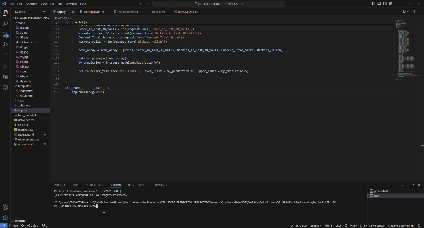

# IPL_INNINGS_WISE_SCORE_PREDICTION_APPLICATION

This project aims to predict the score of an innings in an IPL cricket match using machine learning models. It includes a Jupyter Notebook for model training and a Flask web application for user interaction.

## Summary of the Project

The IPL Innings Wise Score Predictor leverages past 17 years IPL data to train a machine learning model that predicts the final score of an innings based on various input features. The web application allows users to input match-specific details and receive a predicted score.

## Steps Involved in the Project

1. **Data Collection and Preprocessing:**
   - Load IPL match data from `deliveries.csv` and `matches.csv`.
   - Merge the datasets on `match_id`.
   - Convert `over` and `ball` to a single count for easier calculation.
   - Calculate rolling totals for runs and wickets using the last 30 balls.
   - Calculate cumulative scores and wickets.
   - Create new features such as `score_last_30_balls`, `wickets_last_30_balls`, `cumulative_score`, and `cumulative_wickets`.

2. **Feature Engineering:**
   - One-hot encode categorical variables such as batting team, bowling team, and venue.
   - Create aggregate features for better prediction accuracy.

3. **Model Training:**
   - Split the data into training and testing sets.
   - Remove irrelevant columns such as `date`.
   - Select the best regression algorithm using cross-validation scores.
   - Train the selected model on the training data.

4. **Model Saving:**
   - Save the trained model to a file (`best_model.pkl`) using pickle for later use in the web application.

5. **Web Application Development:**
   - Develop a Flask web application to take user input and predict the innings score using the trained model.

## Commands to Setup Project on Local Machine

1. **Clone the repository:**
   ```bash
   git clone https://github.com/dyavadi8769/IPL_Innings_Wise_Score_Predictor.git
   cd IPL_Innings_Wise_Score_Predictor

2.  **Create a virtual environment and activate it:**
    ```bash
    conda create -p env python==3.11 -y
    conda activate env/ 

3.  **Install the Required Dependecies:**
    ```bash
    pip install -r requirements.txt

4. **Run the Web App:**
    ```bash
    python app.py

## Usage





## Contributing

1. Contributions are welcome! Please fork the repository and create a pull request with your changes. 
2. Ensure that your code adheres to the project's coding standards.

